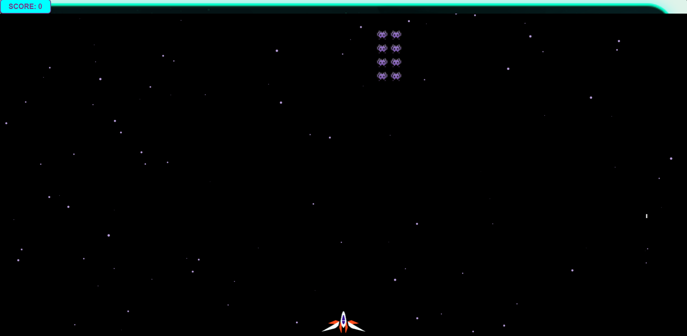

# Starfall — Space Invaders


A modern, arcade-inspired space shooter built with vanilla JavaScript and the HTML5 Canvas API. Battle relentless waves of alien invaders, dodge enemy fire, and rack up your score in fast-paced, retro-meets-cute gameplay.



## Features

- **Player-controlled spaceship** with smooth left/right movement and a subtle tilt animation while turning
- **Wave-based invader grids** — random rows/columns spawn at random intervals, sweeping side to side and stepping down on each wall bounce
- **Shooting with rate limiting** — projectiles are capped to a fixed rate so mashing the fire key/screen doesn't spam bullets
- **Enemy fire** — invaders randomly shoot back; getting hit ends the game
- **Particle effects** — ambient drifting starfield plus explosion particles on hits and destruction
- **Score tracking**, live-updated as invaders are destroyed
- **Game over / restart overlay**
- **Touch controls** for mobile — drag to move, tap to shoot
- **Responsive canvas** that resizes with the window

## Assets

| Asset | Used for |
|---|---|
| `public/spaceship.png` | Player ship sprite |
| `public/invader.png` | Enemy invader sprite (also used as the mascot on the game-over overlay) |
| `public/startScreenBackground.png` | Background art for the start / game-over screen |
| `public/button.png` | Start button graphic |

## Controls

| Input | Action |
|---|---|
| `A` / `←` | Move left |
| `D` / `→` | Move right |
| `Space` | Shoot |
| Drag (touch) | Move ship |
| Tap (touch) | Shoot |

## Project structure

```
├── public/
│   ├── button.png
│   ├── invader.png
│   ├── spaceship.png
│   └── startScreenBackground.png
├── index.css
├── index.html
├── index.js
└── README.md
```

## Getting started

No build step required — it's plain HTML/CSS/JS.

1. Clone or download the project
2. Open `index.html` in a browser, or serve the folder locally, e.g.:
   ```bash
   npx serve .
   ```
3. Play in your browser at the served address

## Tech

- HTML5 Canvas for rendering
- Vanilla JavaScript (ES6 classes: `Player`, `Invader`, `Grid`, `Projectile`, `InvaderProjectile`, `Particle`)
- CSS for the overlay UI and score display

